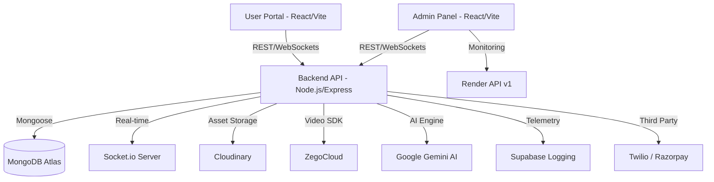

# 🐾 PawVaidya - #1 Veterinary Intelligence Platform in India

[](https://www.mongodb.com/mern-stack)
[](https://vitejs.dev/)
[](https://socket.io/)
[](https://deepmind.google/technologies/gemini/)
[](https://render.com/)

**PawVaidya** is a state-of-the-art, comprehensive veterinary consultancy ecosystem designed to bridge the gap between pet owners and expert veterinarians. Built with the **MERN Stack**, it features real-time consultation, AI-driven diagnostics, and a **Military-Grade Admin Command Center**.

---

## 🏛️ System Architecture



---

## 🔥 Key Features

### 🐶 For Pet Owners (User Portal)
> **Endpoint:** [Live Portal](https://pawvaidya-79qq.onrender.com/)
- **AI-Powered Diagnostics**: Integrated **Gemini AI** chatbot (PawBot) for instant pet health guidance and symptom checking.
- **Smart Appointment Booking**: Easy scheduling with specialized vets (Small Animal, Avian, Exotic, etc.) featuring real-time slot availability.
- **Video Consultations**: Crystal-clear video calls powered by **ZegoCloud** for remote diagnosis.
- **Multilingual Support**: Support for English, Hindi, Tamil, and Telugu using **i18next** and AI-powered translations.
- **Unified Coupon System**: Stacked support allowing users to apply both doctor-specific discounts and platform-wide admin coupons simultaneously.
- **Refined UI & Navigation**: Premium, responsive, and animated user interfaces with intelligent space management.
- **Community Hub**: Share experiences and learn from expert blogs.

### 🏥 For Veterinarians
- **Dynamic Scheduling**: Manage consultation hours and availability slots.
- **Collaborative Polls**: Engage with doctors-only polls for professional insights and platform feedback.
- **Profile Management**: Showcase expertise, experience, and consultancy fees.

### 🛡️ Admin Command Center (Admin Panel)
> **Endpoint:** [Admin Panel](https://pawvaidya-admin-uy9o.onrender.com/)
- **🆕 Render Deployment Monitor**: Full-stack observability for all services:
  - **Live Status**: Real-time deployment tracking and build history.
  - **Network Performance**: High-fidelity charts for HTTP Requests and Egress Bandwidth.
  - **Time Range Control**: Toggle metrics for **12h, 24h, 2d, and 7d**.
  - **Usage Breakdown**: Categorical data analysis (HTTP, WebSockets, NAT, Private Link).
- **System Health Gauges**: Radial SVG gauges for live **CPU, RAM, and Storage** utilization via `systeminformation`.
- **Thermal & Hardware Monitoring**: Animated SVG thermometer with core-level temperature tracking and fan RPM simulation.
- **Security Incident Suite**: 24/7 automated threat detection for **SQLi and XSS** with deep offender fingerprinting (IP, Device, Geolocation).
- **Service Health dashboard**: Live connectivity pings for MongoDB, Cloudinary, SMTP, Supabase, and Gemini AI.
- **User Moderation Suite**: Instant visual identification of "Blacklisted" or banned users directly within the user management views.
- **Advanced Login Security**: 
  - Tracks failed login attempts and triggers threshold email alerts.
  - Implements an intelligent auto-approval loop for whitelisted IP addresses.
  - Pauses logins from unrecognized geolocations until manually approved via email token.
  - Enforces browser location permissions globally before rendering the login portal.

---

## 🛠️ Deep Tech Stack

| Layer | Technologies |
| :--- | :--- |
| **Frontend Core** | React 18, Vite, Tailwind CSS, Framer Motion, Lucide Icons |
| **Backend Core** | Node.js 20, Express 4.21, MongoDB (Mongoose 6.1) |
| **Real-time Engine** | Socket.io 4.8, ZegoCloud Video SDK |
| **AI Integration** | Google Gemini AI (@google/generative-ai), OpenAI SDK |
| **Data & Assets** | Supabase (PostgreSQL/Logging), Cloudinary (Media), Redis (Caching) |
| **Infrastructure** | Render API v1 (Metrics), Twilio (SMS), Razorpay (Payments) |
| **Security** | Argon2/Bcrypt, JWT, Device Fingerprinting, SQLi/XSS Middleware |

---

## 🚀 Getting Started

### Prerequisites
- Node.js (v20.x recommended)
- MongoDB Atlas Key
- Google Cloud Gemini API Key
- Cloudinary Storage Credentials
- Render API Key (for Deployment Dash)

### Installation & Run

1. **Clone & Base Setup**
   ```bash
   git clone https://github.com/AbheetHacker4278/Pawvaidya_personal_project.git
   cd Pawvaidya_personal_project/PawVaidya
   ```

2. **Environment Configuration**
   Each service requires a `.env`. Copy from root reference:
   - `backend/.env`: PORT, MONGODB_URI, JWT_SECRET, RENDER_API_KEY, RENDER_BACKEND_SERVICE_ID...
   - `frontend/.env`: VITE_BACKEND_URL, VITE_ZEGO_APP_ID...
   - `admin/.env`: VITE_BACKEND_URL...

3. **Running Services**
   ```bash
   # Backend
   cd backend && npm install && npm run server

   # Frontend
   cd frontend && npm install && npm run dev

   # Admin
   cd admin && npm install && npm run dev
   ```

---

## 📦 Project Structure

```text
PawVaidya/
├── admin/                  # React Admin Dashboard (Vite)
│   ├── src/pages/Admin/    # AdminDeployments.jsx (New Monitor)
│   └── src/components/     # ServiceHealthDashboard, ThermalMonitor
├── frontend/               # React User Portal (Vite)
│   └── src/pages/          # Appointments, AI Chatbot (PawBot)
├── backend/                # Node.js REST & Web Socket API
│   ├── controllers/        # renderController.js (Metrics Logic)
│   ├── middleware/         # Security Monitor (SQLi/XSS Detection)
│   ├── routes/             # renderRoute.js (Deployment Hooks)
│   └── server.js           # Express & Socket.io initialization
└── docs/                   # SUPABASE_SETUP.md, DEPLOYMENT.md
```

---

## 📄 License & Support
© 2026 **PawVaidya**. All Rights Reserved.
For technical support or security disclosures, please refer to our [Deployment Guide](./PawVaidya/DEPLOYMENT.md).

---
*Developed with ❤️ by the PawVaidya Engineering Team.*
