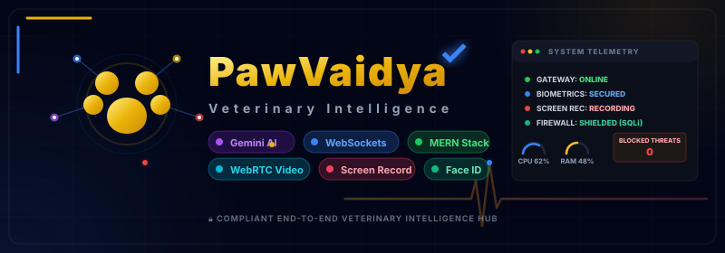
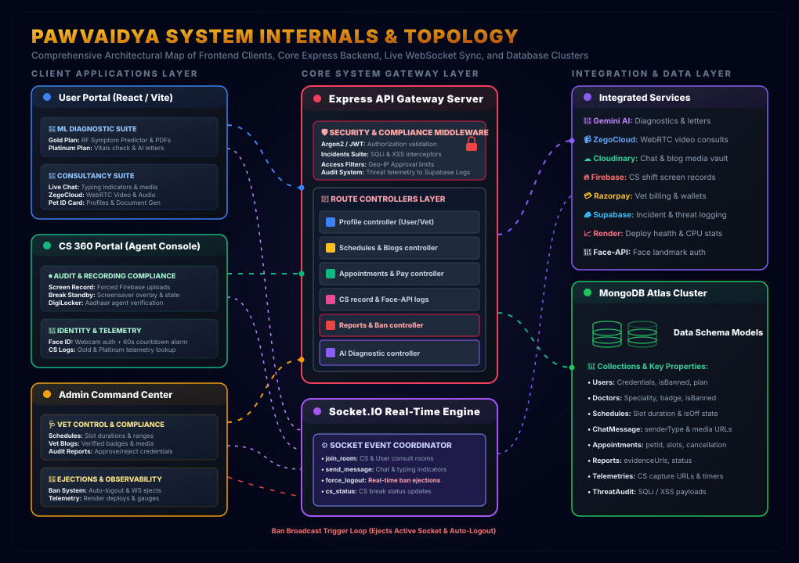

# 🐾 PawVaidya - #1 Veterinary Intelligence Platform in India



<p align="center">
  <a href="https://www.mongodb.com/mern-stack"></a>
  <a href="https://vitejs.dev/"></a>
  <a href="https://socket.io/"></a>
  <a href="https://deepmind.google/technologies/gemini/"></a>
  <a href="https://render.com/"></a>
  <a href="#"></a>
</p>

**PawVaidya** is a state-of-the-art, comprehensive veterinary consultancy ecosystem designed to bridge the gap between pet owners, expert veterinarians, and customer support representatives. Built with the **MERN Stack**, it features real-time consultations, AI-driven diagnostics, and a **Military-Grade Admin Command Center** featuring live service telemetry.

---

## 🏛️ System Architectures

The following diagram illustrates the data flow, real-time feedback loops, and integrations across the PawVaidya platform:



### Architecture Breakdown
- **Frontend Clients:** React applications bundled with Vite, styled with Tailwind CSS, and animated with Framer Motion.
- **Backend API Gateway:** Node.js & Express server handling REST requests, token validation, and raw Socket.IO events.
- **Databases & Logging:** MongoDB Atlas holds operational data while Supabase logs security telemetry.
- **Third-Party SDKs:** Gemini AI processes intelligent diagnostics, Cloudinary stores media attachments, ZegoCloud powers high-fidelity video consults, and Razorpay processes payments.

---

## 🔥 Key Features & Recent Enhancements

### 🐶 For Pet Owners (User Portal)
> **Endpoint:** [Live User Portal](https://pawvaidya-79qq.onrender.com/)

- **AI-Powered Diagnostics (PawBot)**: Integrated Gemini AI chatbot for symptom checking, diet guidance, and general advice.
- **🥇 Gold Plan - Animal Disease Predictor**: Comprehensive multi-symptom severity analysis (severity scales 1 to 5) matching `animal-disease-predictor` standards, complete with dynamic Random Forest matching probabilities, clinical progression chronicles, and automated printable PDF health sheets.
- **💎 Platinum Plan - ML Animal Health Predictor**: Live physical vital signs tracker (Temperature °C, Pulse bpm, Respiratory Rate) checking against species physiological baselines, integrated with generative veterinary AI health advisory letters.
- **Real-Time Consultations & Chat**:
  - Instant text communication with doctors via **Socket.IO**.
  - **Media Previews & Lightboxes**: Image thumbnails load with custom spinners and open in a full-screen lightbox. Videos play inline and open in an interactive overlay.
  - **File Sharing**: Secure upload for images, videos, and documents (up to 10MB) via Cloudinary with upload progress states.
  - **Typing Indicators**: Displays animated text telling you when the doctor is drafting a reply.
- **Video Consultations**: Crystal-clear video calls powered by **ZegoCloud** for remote diagnosis.
- **Official Pet ID Cards**: Automated generation of premium, high-fidelity identity documents for every pet profile.
- **Stray Animal Support**: Location-based tracking workflow to report, monitor, and book appointments for injured strays.
- **Multilingual Support**: Supports English, Hindi, Tamil, and Telugu using **i18next** and AI-powered translations.
- **Unified Coupon System**: Stacked support allowing users to apply both doctor-specific discounts and platform-wide admin coupons.

---

### 🏥 For Veterinarians
- **🆕 Doctor Schedule Management System**:
  - Set customized weekly availability for each day.
  - Choose session slots of 15, 30, 45, or 60 minutes.
  - Quick toggle to enable or disable active schedule profiles without deletion.
  - Real-time slot synchronization that blocks past slots and booked schedules.
- **🆕 Doctor Blog Creation with Professional Badge**:
  - Write and publish rich articles directly to the community hub.
  - Blue gradient **"Doctor" Checkmark Badge** with the doctor's specific speciality (e.g. "Veterinary Surgeon") to build trust.
  - Upload up to 5 images (10MB each) and 2 videos (50MB each) per blog post.
  - Track real-time engagement statistics (likes, views, comments).
- **Dynamic Appointments Dashboard**: Complete overview of patient pet profiles (age, breed, history) to prepare for appointments.

---

### 🛡️ Admin Command Center (Admin Panel)
> **Endpoint:** [Admin Panel](https://pawvaidya-admin-uy9o.onrender.com/)

- **🆕 Real-time Ban System with Auto-Logout**:
  - Instantly block malicious users or doctors via the admin report detail interface.
  - Automatically cancels all active or pending appointments related to the banned account.
  - Emits real-time `user-banned` or `doctor-banned` socket events to clear local storage, show a persistence toast message, and redirect the banned user to the login screen immediately.
- **Render Deployment Monitor**: Full-stack observability for all services, tracking live deployment status, build history, and CPU/RAM/bandwidth metrics over customizable timeframes (12h, 24h, 2d, 7d).
- **Security Incident Suite**: 24/7 automated threat detection for SQLi and XSS with deep offender fingerprinting (IP, Device, Geolocation).
- **System Health Gauges**: Radial SVG gauges for live server hardware monitoring (CPU, Memory, Storage) utilizing `systeminformation`.
- **Advanced Login Security**: Geolocation permission enforcement, IP whitelisting loops, and login token overrides.

---

### 🎧 Customer Service Portal
> **Endpoint:** [Support Portal](https://customer-service-kx9x.onrender.com/)

- **🆕 Mandatory CS Agent Screen Recording System**:
  - Screen recording is enforced during shifts to maintain compliance.
  - Interactive overlay screen prevents agents from proceeding unless they share and record their screen.
  - Uploads recordings directly to Firebase storage.
  - **Auto-Standby Break Screensaver**: Recording automatically pauses during breaks, displaying a standby screen.
  - **Post-Break Face ID Verification**: Enforces a 60-second face-scan countdown utilizing **Face-API.js** and webcams, with loops playing high-volume warning alarms if the timer expires.
- **Premium Diagnostic Telemetry Logs (Customer 360)**: Tabbed support tracking panel inside `/customer-360` allowing agents to review a user's Gold disease predictions (severity levels, timelines, confidence gauges) and Platinum biological logs (vitals grids, LLM advice sheets) with perfect dark glassmorphism styling.
- **Developer Quick-Login Bypass Suite**: A dev-only expandable drawer on the login page coupled with backend `/api/cs/dev-list` and `/api/cs/dev-login` bypass routes for instant visual testing and automated QA.

---

## 🎨 Animations & Transitions Showcase

PawVaidya features a premium UI design incorporating rich interactive motion to enhance usability:

### 1. Motion Elements (Framer Motion)
* **Smooth Dropdowns & Drawers**: Slide-in transitions (`x: '-100%'` to `x: 0`) and fade-ins (`opacity: 0` to `opacity: 1`) on the Developer Login drawer and Chat sidebars.
* **Alert & Overlay Scale Bounds**: The Screen Recording Overlay bounces into view (`scale: 0.9` to `scale: 1`) and features glowing ambient neon spheres drifting slowly in the background.
* **Dashboard Card Cascades**: Doctor blog posts and schedules load with stagger-effect transitions, easing into position from bottom to top.

### 2. Loading Micro-Animations
* **Interactive Media Spinners**: Image and video chat previews display a rotating Tailwind-animated CSS circle (`animate-spin`) until full metadata resolution.
* **Typing Indicators**: Three jumping dots powered by CSS keyframes animate up and down sequentially to signal message drafting.

### 3. Audiovisual Transitions
* **Urgent Alarms**: Red alert banners pulse globally with audio chimes loop-played from external SFX assets during the Post-Break Face Scan countdown.
* **Camera Scans**: Biometric scanner runs a horizontal neon line sweep down the camera capture view during Face ID validation.

---

## 🛠️ Deep Tech Stack

| Layer | Technologies |
| :--- | :--- |
| **Frontend Core** | React 18, Vite, Tailwind CSS, Framer Motion, Lucide Icons, React-Icons |
| **Backend Core** | Node.js 20, Express 4.21, MongoDB (Mongoose 6.1) |
| **Real-time Engine** | Socket.io 4.8, ZegoCloud Video SDK, Face-API.js |
| **AI Integration** | Google Gemini AI (`@google/generative-ai`), OpenAI SDK |
| **Data & Assets** | Supabase (Logging), Cloudinary (Media), Firebase Storage (Screen recordings) |
| **Security** | Argon2/Bcrypt, JWT, Device Fingerprinting, SQLi/XSS Middleware |

---

## 🚀 Getting Started

### Prerequisites
- Node.js (v20.x recommended)
- MongoDB Atlas URI
- Google Gemini API Key
- Cloudinary Storage Credentials
- Render API Key (for Deployment Dash)
- Firebase Configuration (for Screen Records)

### Installation & Run

1. **Clone & Base Setup**
   ```bash
   git clone https://github.com/AbheetHacker4278/Pawvaidya_personal_project.git
   cd Pawvaidya_personal_project/PawVaidya
   ```

2. **Environment Configuration**
   Setup `.env` files in each service directory:
   - `backend/.env`: `PORT`, `MONGODB_URI`, `JWT_SECRET`, `RENDER_API_KEY`...
   - `frontend/.env`: `VITE_BACKEND_URL`, `VITE_ZEGO_APP_ID`...
   - `admin/.env`: `VITE_BACKEND_URL`...
   - `cs-portal/.env`: `VITE_BACKEND_URL`...

3. **Running Services**
   Open separate terminals for each workspace:
   ```bash
   # Terminal 1 - Backend API Server (Port 4000)
   cd backend && npm install && npm run server

   # Terminal 2 - User Frontend (Port 5173)
   cd frontend && npm install && npm run dev

   # Terminal 3 - Doctor & Admin Portal (Port 5174)
   cd admin && npm install && npm run dev

   # Terminal 4 - Customer Service Portal (Port 5175)
   cd cs-portal && npm install && npm run dev
   ```

---

## 📝 Key API Endpoints

### 📅 Doctor Schedule
```http
POST   /api/doctor-schedule/add-update       - Add/edit availability
POST   /api/doctor-schedule/get-schedules    - Fetch doctor's schedules
POST   /api/doctor-schedule/delete           - Delete active schedule
POST   /api/doctor-schedule/toggle-status    - Toggle availability status
GET    /api/doctor-schedule/public/:docId    - Fetch schedule for booking (Public)
```

### 💬 Real-Time Chat
```http
GET    /api/chat/messages/:appointmentId     - Get chat history
POST   /api/chat/send                        - Send text message
POST   /api/chat/upload-file                 - Send media file (images, videos, PDFs)
```

### 🚫 Reports & Bans
```http
POST   /api/report/submit                    - Submit User/Doctor report
POST   /api/report/ban-user                  - Ban User & Cancel appointments (Admin Only)
POST   /api/report/ban-doctor                - Ban Doctor & Cancel appointments (Admin Only)
POST   /api/report/unban-user                - Unban User (Admin Only)
POST   /api/report/unban-doctor              - Unban Doctor (Admin Only)
```

---

## 📦 Project Structure

```text
PawVaidya/
├── admin/                  # React Admin Dashboard (Vite)
│   ├── src/pages/Doctor/   # DoctorSchedule.jsx, DoctorBlogs.jsx
│   ├── src/pages/Admin/    # AdminDeployments.jsx (Observability)
│   └── src/hooks/          # useDoctorBanListener.jsx (Auto-Logout)
├── cs-portal/              # React Customer Service Portal (Vite)
│   ├── src/pages/          # FaceVerify.jsx, DigiLocker.jsx
│   └── src/components/     # ScreenRecordOverlay.jsx, PostBreakVerifyOverlay.jsx
├── frontend/               # React User Portal (Vite)
│   ├── src/components/     # AppointmentChat.jsx (Lightbox & Previews)
│   └── src/hooks/          # useBanListener.jsx (Real-time Logout)
├── backend/                # Node.js API Gateway & Sockets
│   ├── controllers/        # reportController.js, doctorScheduleController.js
│   ├── routes/             # reportRoute.js, chatRoute.js
│   └── socketServer.js     # Real-time message & ban loops
└── docs/                   # SVG Diagrams & Setup Manuals
```

---

© 2026 **PawVaidya**. All Rights Reserved.  
*Developed with ❤️ by the PawVaidya Engineering Team.*
